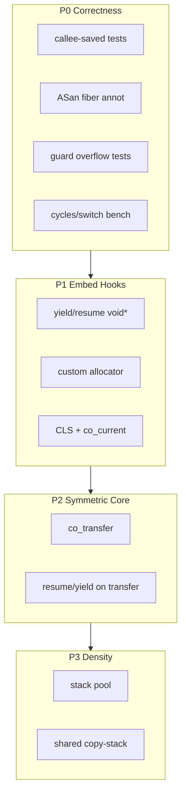

# 可靠可嵌入 C Fiber Primitive 路線圖

現況是精簡的 **asymmetric** API（`[coroutine.h](coroutine.h)` / `[coroutine.c](coroutine.c)`），每協程獨立 mmap/VirtualAlloc + 雙端 guard；底層 `co_context_switch(from,to)` 已跨四平台。定位改為 **可靠、可嵌入的 C fiber primitive** 後，優先順序是正確性與嵌入面，密度（copy-stack）放最後。




---

## P0 — 正確性深度（先於新功能）

目標：切換與堆疊契約有可回歸的證據，之後改狀態機才敢動。

### 暫存器 / FP 單元測試（per-arch）

- 新增 `test_regs_<arch>.c`（或分 section 進 `[test_coroutine.c](test_coroutine.c)`）：在協程內寫滿 callee-saved（x86：`rbx/rbp/r12–15` + 改 MXCSR；Win64 另 xmm6–15；AArch64：`x19–x28` + `d8–d15`），yield 後由另一側覆寫同暫存器再 resume，斷言值復原。
- 參考現有 asm 邊界：`[platform/Linux_x86/sysV.S](platform/Linux_x86/sysV.S)`、`[platform/Windows_x64/win64.S](platform/Windows_x64/win64.S)`、`[platform/linux_aarch64/aarch.S](platform/linux_aarch64/aarch.S)`。

### ASan fiber annotation

- 在 `[coroutine.c](coroutine.c)` 的 `co_context_switch` 呼叫前後包一層（weak symbol / `#ifdef __SANITIZE_ADDRESS__`）：
  - `__sanitizer_start_switch_fiber`（切出前）
  - `__sanitizer_finish_switch_fiber`（切入後）
- 傳入目標 stack 的 `lo`/`hi`（來自 `struct co_stack`）。
- **主協程**：於 `ensure_initialized` 以 `co_platform_query_thread_stack` 取得真實 stack 邊界傳入 ASan（非傳 NULL）。
- **fake_stack**：切出時保存、切入時還原至 `struct coroutine.asan_fake_stack`，以支援 `-fsanitize=address` 下的 stack use-after-return 偵測。

### Guard / 巢狀 / 生命週期

- **Guard 溢位**：故意寫穿 `lo`/`hi`，斷言 SIGSEGV/VEH 路徑可偵測（可用 `fork` 或預期 abort 的子測，避免拖垮整個 suite）。診斷 handler 為 **opt-in**（見下方宿主共存）。
- **巢狀深度**：多層 resume 鏈（已有一層 nested，擴到 N 層 + `CO_WAITING` 不可再 resume）。
- **大量建立銷毀**：例如 10⁴–10⁵ 個短命協程 create/resume/destroy，盯 RSS 與失敗率；順便暴露 guard 表 4096 上限的診斷退化。
- **FP 控制**：x86 測 MXCSR/x87 CW 跨切換；AArch64 文件化「不保存 FPCR/FPSR」（與現況一致，不當 bug）。

### Benchmark

- 獨立 `bench_switch`：空 yield/resume 迴圈，報 **cycles/switch**（`rdtsc` / `cntvct_el0`）與 switches/sec；Makefile 目標 `make bench`。與現有 `--speed` stress 分開，避免混正確性與效能。

**交付物**：測試綠燈成為合併門檻；ASan build（`CFLAGS=-fsanitize=address`）能跑通基本 suite。

---

## P1 — 嵌入鉤子（傳值 / allocator / CLS）

皆以 **C 層**為主，不動 asm。

### Yield / resume 傳值（Lua 風格，`void*`）

鎖定 API（允許破壞現有簽名，庫仍早期）：

```c
co_result co_resume(coroutine *co, void *arg, void **out);
co_result co_yield_now(void *arg, void **out);  /* 保留名稱，加傳值參數 */
```

**C++ 相容性**：公開 API **不得**使用 C++20 coroutine 關鍵字（`co_yield`、`co_await`、`co_return`）。本庫為 C fiber primitive，標頭含 `extern "C"` 時 C++ 翻譯單元仍無法以 `co_yield` 作為函式名稱宣告或呼叫。

**Mailbox 契約（全庫唯一）**：在 `struct coroutine` 加 `void *transfer` 作為每協程的收件匣。切換一律透過 `co_exchange_and_switch(from, to, data)`：

- 切換前：`to->transfer = data`（寫入**收件人**信箱）
- 切換後：讀 `from->transfer`（讀**自己**信箱裡對方剛寫的值）

```c
static void *co_exchange_and_switch(struct coroutine *from,
                                    struct coroutine *to,
                                    void *data)
{
    to->transfer = data;
    co_do_switch(&from->context, &to->context, from, to);
    return from->transfer;
}
```

- `co_resume`：`got = co_exchange_and_switch(caller, target, arg)`；若 `out` 非 NULL，`*out = (target->state == CO_DONE) ? NULL : got`。
- `co_yield_now`：`got = co_exchange_and_switch(self, caller, arg)`；若 `out` 非 NULL，`*out = got`。
- 協程內讀「上次 resume 傳入的 arg」：在 `co_yield_now` 返回後讀 `*out`（或下次 yield 醒來後的 `*out`），**不**與 `co_create` 的 `argument` 混用。
- 結束：trampoline 切回前設 `caller->transfer = NULL`（或僅依 `CO_DONE` 強制 `*out = NULL`）；`co_finished` 仍分辨結束 vs yield。
- **小 buffer**：同階段加可選 storage（minicoro 風格），例如：

```c
co_result co_set_storage(coroutine *co, void *buf, size_t cap);
void     *co_storage(coroutine *co);
size_t    co_storage_size(coroutine *co);
```

預設不配置；需要時由呼叫端提供，避免庫內隱式 heap。

### Custom allocator

```c
typedef struct co_allocator {
    void *(*alloc)(size_t size, void *ud);
    void  (*free)(void *ptr, size_t size, void *ud);
    void  *userdata;
} co_allocator;

void co_set_allocator(const co_allocator *a); /* 進程級；NULL = libc + 平台 stack */
```

- `co_create` 的 `coroutine` 物件走 allocator；stack 仍先走平台 `co_stack_create`，但改為可注入（見下）。
- 平台邊界：`[co_stack_create](coroutine_internal.h)` 增加「外部提供記憶體」路徑，或 `co_stack_create_from(base, total)`，讓 pool/測試可餵預留區。Guard page 策略：自訂 raw 記憶體時 **預設不設 guard**（文件註明），或要求 size 含 guard 並由庫 `mprotect`——鎖定為：**庫只在「自己 mmap/VirtualAlloc」路徑設 guard；外部 buffer 呼叫端負責保護**。

### CLS + `co_current`

```c
coroutine *co_current(void);
int  co_cls_alloc(void);           /* 回 key，進程級 */
void co_cls_set(int key, void *v);
void *co_cls_get(int key);
```

- CLS 陣列掛在 `struct coroutine`（固定小 N，如 8/16，或可擴充指標表）；主協程 TLS 槽同樣支援，使「任意時刻」都能讀。
- 與現有 thread affinity（`owner_id` 單調序號）一致：CLS 不跨執行緒。

---

## 執行期契約與嵌入約束（D-1..D-7，已落地）

公開契約細節以 `[coroutine.h](coroutine.h)` 為準；本節為路線圖對照。

### 執行緒契約

- **Owner id**：process 生命週期內唯一的單調序號（monotonic serial），**不是** TLS 物件位址；執行緒結束後不重用，避免 token 誤認。
- **`co_thread_shutdown`**：owner 結束前的 caller 義務入口；掃描名下協程，可合法 destroy 者釋放，掛起中者計入 leaked。
- **Thread-exit orphan reclaim**：若未先乾淨結束，庫在執行緒退出時回收控制塊與 mmap／VirtualAlloc 堆疊（非「kill 協程」語意；callback 內未釋放的 C 物件視同 abort）。
- **`co_destroy(SUSPENDED)`**（以及 WAITING／RUNNING）仍回 `CO_RESULT_INVALID_STATE`；與 orphan reclaim 分路徑。

### 宿主共存

- Crash handler + altstack 為 **opt-in**：預設不安裝；standalone 需要 guard 溢位診斷時呼叫 `co_install_crash_handler(1)`。
- 不安裝時不覆寫宿主已有的 `sigaltstack`；宿主已有 altstack 則跳過配置。
- ASan 建置下 handler 與 altstack 皆跳過（交給 ASan）。
- Windows VEH 同為 opt-in（與 POSIX handler 同一 API）。

### Stack 上下限

- `CO_MIN_STACK_SIZE`（16 KiB）／`CO_MAX_STACK_SIZE`（1 GiB）。
- `co_create`／`co_create_ex`：非法大小回錯誤碼（`INVALID_ARGUMENT` 或 OOM），**禁止**因參數觸發 SIGSEGV。

### Guard 表

- `CO_MAX_TRACKED_STACKS=4096`。
- 表滿時 **不淘汰**既有條目；新堆疊可能缺少溢位診斷字串（診斷降級，不影響正確性）。

### 平台 init

- `page_size`：lazy、atomic 初始化，避免多執行緒競態。
- 進程級共享 lazy 狀態：atomic／once，與 handler 安裝的 once 語意一致。

---

## P2 — 對稱切換為底層原語

目標：Boost.context 模型；非對稱 API 建在上面。

### `co_transfer`

```c
typedef struct co_transfer_t {
    coroutine *prev;
    void      *data;
} co_transfer_t;

co_transfer_t co_transfer(coroutine *to, void *data);
```

- **C 層實作（首選）**：`data` 走 `transfer` 欄位；asm 維持 `void co_context_switch(from,to)`，不改四平台 `.S`。
- 狀態機：`to` 可為任意 `SUSPENDED`/`READY`；清除嚴格「只能 yield 回 caller」的底層限制；`caller` 改為非對稱包裝維護。
- 非對稱改寫：
  - `co_resume` = 設 caller + `co_transfer(target, arg)`，回來後清 caller
  - `co_yield_now` = `co_transfer(self->caller, arg)`
- `CO_WAITING`：巢狀 resume 時仍標記外層，防止對同一協程重入；對稱排程器若自管，可不使用 `co_resume`。

首次進入 trampoline：模擬一次「來自 creator 的 transfer」，`data` 為 create 時的 `argument`（或 resume 傳入的第一個值——與 Lua 對齊：**第一次 resume 的 arg 當入口參數**，`co_create` 的 argument 可保留為 userdata）。

### TSan fiber annotations（佔位）

當存在 `co_transfer`／跨 fiber 排程器時，需在 create／switch／destroy 接上：

- `__tsan_create_fiber`
- `__tsan_switch_to_fiber`
- `__tsan_destroy_fiber`

（P2 實作項；目前 asymmetric-only 路徑尚未強制。）

### 外部 stack API 決策（P2 decision item）

`co_stack_create_from` 已存在於內部／平台層。公開面二選一：

- **建議 A（Recommend A）**：公開 `co_create_with_stack`，包裝 `co_stack_create_from`，供 P3 pool／測試餵預留區。
- 替代 B：移除死 API，僅保留庫內 mmap／VirtualAlloc 路徑。

P2 須明確鎖定其一；路線圖預設採 **A**。

---

## P3 — 密度：Stack pool → Shared / copy-stack

### Stack pool（先做）

- 依 size class（16K/64K/…）回收 `co_stack`；`co_destroy` 歸還 pool，`co_create` 優先取用。
- 接 P1 allocator；上限可配置（避免永久佔用 RSS）。
- 此階段仍是 **private stack**，只減 mmap 次數；正確性與 API 不變。
- 若採 P2 建議 A，pool 經 `co_create_with_stack`／`co_stack_create_from` 餵區。

### Shared / copy-stack（最後、高風險）

- 新模式旗標：`CO_STACK_PRIVATE`（預設）vs `CO_STACK_SHARE`。
- 一組協程共用大 stack；suspend 時把 `[SP .. stack_hi)` copy 到私有 save buffer，resume 再 copy 回去（libaco 模型）。
- **硬限制（文件 + 執行期檢查）**：
  - 同一 share 組不可巢狀 resume（與現有 nested 測試互斥）
  - 不可與 ASan fiber 邊界混用除非額外註解
  - save buffer 走 allocator/pool
- 平台：`initialize_context` 指向共享 `hi`；切換前後在 `[coroutine.c](coroutine.c)` 做 memcpy，asm 仍不變。
- 成功標準：同 RSS 下可建立的掛起協程數 ≫ private 64KiB 模式（例如 10⁵ 級小 save）。

---

## API 演進一覽（鎖定後的公開面）


| 階段  | 新增 / 變更                                                                         |
| --- | ------------------------------------------------------------------------------- |
| P0  | 測試與 bench；行為不變                                                                  |
| P1  | `co_resume`/`co_yield_now` 帶 `void*`；`co_set_allocator`；`co_current`；CLS；可選 storage |
| D-1..D-7 | `owner_id`、`co_thread_shutdown`、stack MAX、opt-in crash handler、ASan bounds/fake_stack |
| P2  | `co_transfer`；resume/yield 改為其上包裝；TSan fiber；外部 stack 公開決策                         |
| P3  | stack pool 預設開啟；`co_create_opts` 選 share/copy                                   |


內部 `[struct coroutine](coroutine_internal.h)` 預計擴充：`transfer`、`cls`、`stack_mode`、`save_buf`、`share` 指標；平台 `co_stack_*` 增加 external/pool 路徑。

---

## 回歸矩陣（checklist）

- [ ] Owner 跨執行緒：`WRONG_THREAD`；`owner_id` 單調、不重用
- [ ] Stack bounds：`SIZE_MAX`、`1<<46` 等 → 錯誤碼，不 SIGSEGV
- [ ] ASan：P0 + P1 suite（main bounds + fake_stack／UAR）
- [ ] Handler／altstack：預設 off；`co_install_crash_handler(1)` opt-in；不覆寫宿主 altstack
- [ ] `page_size` 並發 lazy init
- [ ] Guard 表滿：無 eviction；新 stack 可能缺診斷
- [ ] 乾淨連結：`Makefile.p0`／`Makefile.p1` 無多餘物件／符號衝突

---

## 刻意不做（本路線）

- 再加平台（i386、Windows ARM 等）——正確性優先於廣度。
- 跨執行緒 migrate 協程。
- C++ 例外穿越 / 自動 unwind destroy。
- AArch64 保存 FPCR/FPSR（非 ABI callee-saved）。
- 公開 API 使用 C++20 coroutine 關鍵字作為識別字（`co_yield` / `co_await` / `co_return`）。

---

## 建議落地節奏

1. **P0**（已完成）：regs + ASan + guard/生命週期測 + `make bench`
2. **P1**（已完成）：傳值 + allocator + CLS
3. **D-1..D-7**（已完成）：執行緒／堆疊／宿主／ASan／page_size／guard 表契約
4. **P2**（1 迭代）：`co_transfer` 重構狀態機；TSan fiber；鎖定 `co_create_with_stack`（建議 A）
5. **P3a pool → P3b copy-stack**：pool 可先合入；copy-stack 單獨 RFC/分支，附密度 benchmark 與限制文件
