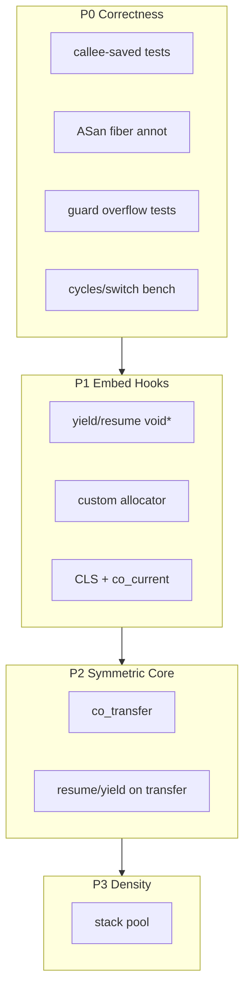

# 可靠可嵌入 C Fiber Primitive 路線圖

現況是精簡的 **asymmetric** API（`[coroutine.h](coroutine.h)` / `[coroutine.c](coroutine.c)`），每協程獨立 mmap/VirtualAlloc + 雙端 guard；底層 `co_context_switch(from,to)` 已跨四平台。定位改為 **可靠、可嵌入的 C fiber primitive** 後，優先順序是正確性與嵌入面；密度只做到 TLS private-stack pool（P3a）。shared copy-stack（原 P3b）已放棄。




---

## P0 — 正確性深度（先於新功能）

目標：切換與堆疊契約有可回歸的證據，之後改狀態機才敢動。

### 暫存器 / FP 單元測試（per-arch）

- 新增 `test_regs_<arch>.c`（或分 section 進 `[test_coroutine.c](test_coroutine.c)`）：在協程內寫滿 callee-saved（x86：`rbx/rbp/r12–15` + 改 MXCSR；Win64 另 xmm6–15；AArch64：`x19–x28` + `d8–d15`），yield 後由另一側覆寫同暫存器再 resume，斷言值復原。
- 參考現有 asm 邊界：`[platform/Linux_x86/sysV.S](platform/Linux_x86/sysV.S)`、`[platform/Windows_x64/win64.S](platform/Windows_x64/win64.S)`、`[platform/linux_aarch64/aarch.S](platform/linux_aarch64/aarch.S)`。

### ASan fiber annotation

- 在 `[coroutine.c](coroutine.c)` 的 `co_context_switch` 呼叫前後包一層（weak symbol / `#ifdef __SANITIZE_ADDRESS__`）：
  - `__sanitizer_start_switch_fiber`（切出前）
  - `__sanitizer_finish_switch_fiber`（切入後）
- 傳入目標 stack 的 `lo`/`hi`（來自 `struct co_stack`）。
- **主協程**：於 `ensure_initialized` 以 `co_platform_query_thread_stack` 取得真實 stack 邊界傳入 ASan（非傳 NULL）。
- **fake_stack**：切出時保存、切入時還原至 `struct coroutine.asan_fake_stack`，以支援 `-fsanitize=address` 下的 stack use-after-return 偵測。

### Guard / 巢狀 / 生命週期

- **Guard 溢位**：故意寫穿 `lo`/`hi`，斷言 SIGSEGV/VEH 路徑可偵測（可用 `fork` 或預期 abort 的子測，避免拖垮整個 suite）。診斷 handler 為 **opt-in**（見下方宿主共存）。
- **巢狀深度**：多層 resume 鏈（已有一層 nested，擴到 N 層 + `CO_WAITING` 不可再 resume）。
- **大量建立銷毀**：例如 10⁴–10⁵ 個短命協程 create/resume/destroy，盯 RSS 與失敗率；順便暴露 guard 表 4096 上限的診斷退化。
- **FP 控制**：x86 測 MXCSR/x87 CW 跨切換；AArch64 文件化「不保存 FPCR/FPSR」（與現況一致，不當 bug）。

### Benchmark

- 獨立 `bench_switch`：空 yield/resume 迴圈，報 **cycles/switch**（`rdtsc` / `cntvct_el0`）與 switches/sec；Makefile 目標 `make bench`。與現有 `--speed` stress 分開，避免混正確性與效能。

**交付物**：測試綠燈成為合併門檻；ASan build（`CFLAGS=-fsanitize=address`）能跑通基本 suite。

---

## P1 — 嵌入鉤子（傳值 / allocator / CLS）

皆以 **C 層**為主，不動 asm。

### Yield / resume 傳值（Lua 風格，`void*`）

鎖定 API（允許破壞現有簽名，庫仍早期）：

```c
co_result co_resume(coroutine *co, void *arg, void **out);
co_result co_yield_now(void *arg, void **out);  /* 保留名稱，加傳值參數 */
```

**C++ 相容性**：公開 API **不得**使用 C++20 coroutine 關鍵字（`co_yield`、`co_await`、`co_return`）。本庫為 C fiber primitive，標頭含 `extern "C"` 時 C++ 翻譯單元仍無法以 `co_yield` 作為函式名稱宣告或呼叫。

**Mailbox 契約（全庫唯一）**：在 `struct coroutine` 加 `void *transfer` 作為每協程的收件匣。切換一律透過 `co_exchange_and_switch(from, to, data)`：

- 切換前：`to->transfer = data`（寫入**收件人**信箱）
- 切換後：讀 `from->transfer`（讀**自己**信箱裡對方剛寫的值）

```c
static void *co_exchange_and_switch(struct coroutine *from,
                                    struct coroutine *to,
                                    void *data)
{
    to->transfer = data;
    co_do_switch(&from->context, &to->context, from, to);
    return from->transfer;
}
```

- `co_resume`：`got = co_exchange_and_switch(caller, target, arg)`；若 `out` 非 NULL，`*out = (target->state == CO_DONE) ? NULL : got`。
- `co_yield_now`：`got = co_exchange_and_switch(self, caller, arg)`；若 `out` 非 NULL，`*out = got`。
- 協程內讀「上次 resume 傳入的 arg」：在 `co_yield_now` 返回後讀 `*out`（或下次 yield 醒來後的 `*out`），**不**與 `co_create` 的 `argument` 混用。
- 結束：trampoline 切回前設 `caller->transfer = NULL`（或僅依 `CO_DONE` 強制 `*out = NULL`）；`co_finished` 仍分辨結束 vs yield。
- **小 buffer**：同階段加可選 storage（minicoro 風格），例如：

```c
co_result co_set_storage(coroutine *co, void *buf, size_t cap);
void     *co_storage(coroutine *co);
size_t    co_storage_size(coroutine *co);
```

預設不配置；需要時由呼叫端提供，避免庫內隱式 heap。

### Custom allocator

```c
typedef struct co_allocator {
    void *(*alloc)(size_t size, void *ud);
    void  (*free)(void *ptr, size_t size, void *ud);
    void  *userdata;
} co_allocator;

void co_set_allocator(const co_allocator *a); /* 進程級；NULL = libc + 平台 stack */
```

- `co_create` 的 `coroutine` 物件走 allocator；stack 仍先走平台 `co_stack_create`，但改為可注入（見下）。
- 平台邊界：`[co_stack_create](coroutine_internal.h)` 增加「外部提供記憶體」路徑，或 `co_stack_create_from(base, total)`，讓 pool/測試可餵預留區。Guard page 策略：自訂 raw 記憶體時 **預設不設 guard**（文件註明），或要求 size 含 guard 並由庫 `mprotect`——鎖定為：**庫只在「自己 mmap/VirtualAlloc」路徑設 guard；外部 buffer 呼叫端負責保護**。

### CLS + `co_current`

```c
coroutine *co_current(void);
int  co_cls_alloc(void);           /* 回 key，進程級 */
void co_cls_set(int key, void *v);
void *co_cls_get(int key);
```

- CLS 陣列掛在 `struct coroutine`（固定小 N，如 8/16，或可擴充指標表）；主協程 TLS 槽同樣支援，使「任意時刻」都能讀。
- 與現有 thread affinity（`owner_id` 單調序號）一致：CLS 不跨執行緒。

---

## 執行期契約與嵌入約束（D-1..D-7，已落地）

公開契約細節以 `[coroutine.h](coroutine.h)` 為準；本節為路線圖對照。

### 執行緒契約

- **Owner id**：process 生命週期內唯一的單調序號（monotonic serial），**不是** TLS 物件位址；執行緒結束後不重用，避免 token 誤認。
- **`co_thread_shutdown`**：owner 結束前的 caller 義務入口；掃描名下協程，可合法 destroy 者釋放，掛起中者計入 leaked。
- **Thread-exit orphan reclaim**：若未先乾淨結束，庫在執行緒退出時回收控制塊與 mmap／VirtualAlloc 堆疊（非「kill 協程」語意；callback 內未釋放的 C 物件視同 abort）。
- **`co_destroy(SUSPENDED)`**（以及 WAITING／RUNNING）仍回 `CO_RESULT_INVALID_STATE`；與 orphan reclaim 分路徑。

### 宿主共存

- Crash handler + altstack 為 **opt-in**：預設不安裝；standalone 需要 guard 溢位診斷時呼叫 `co_install_crash_handler(1)`。
- 不安裝時不覆寫宿主已有的 `sigaltstack`；宿主已有 altstack 則跳過配置。
- ASan 建置下 handler 與 altstack 皆跳過（交給 ASan）。
- Windows VEH 同為 opt-in（與 POSIX handler 同一 API）。

### Stack 上下限

- `CO_MIN_STACK_SIZE`（16 KiB）／`CO_MAX_STACK_SIZE`（1 GiB）。
- `co_create`／`co_create_ex`：非法大小回錯誤碼（`INVALID_ARGUMENT` 或 OOM），**禁止**因參數觸發 SIGSEGV。

### Guard 表

- `CO_MAX_TRACKED_STACKS=4096`。
- 表滿時 **不淘汰**既有條目；新堆疊可能缺少溢位診斷字串（診斷降級，不影響正確性）。

### 平台 init

- `page_size`：lazy、atomic 初始化，避免多執行緒競態。
- 進程級共享 lazy 狀態：atomic／once，與 handler 安裝的 once 語意一致。

### D-9：合作式取消（`co_cancel` + sentinel，已落地）

- **問題**：`co_destroy` 僅允許 `CO_READY`／`CO_DONE`；提前放棄的 generator 卡在 `CO_SUSPENDED` 時 64 KiB 回不來。
- **作法**：`co_cancel(co)` 以 `CO_CANCEL` mailbox sentinel resume 掛起協程；回呼在 yield 點用 `co_is_cancel` 檢查並 return。成功只把狀態推到 `CO_DONE`，**不**自動 destroy；回收一律 `co_destroy`。
- **狀態**：`READY` 不跑 body、標 `DONE`、回 `CANCEL_NOT_STARTED`；`DONE` 冪等 `OK`（不改旗標）；`SUSPENDED` resume sentinel；`RUNNING`／`WAITING` 拒絕；違約再 yield → `CANCEL_IGNORED`。`cancelling` 跨呼叫保留，可由 `co_cancel_requested` 查詢。
- **違約終局**：第二次 `co_cancel` 見旗標已為 1 則不再注入 sentinel，回 `CANCEL_IGNORED`（不因 `NDEBUG` abort）。手動 `co_resume(CO_CANCEL)` 仍可再注入（不設旗標）。opt-in 診斷：`-DCO_DIAG_CANCEL=1`。
- **維持**：`co_destroy(SUSPENDED)` 仍 `INVALID_STATE`；`co_thread_shutdown` 不自動 cancel；已到 `DONE` 的由 shutdown 正常 destroy。

---

## P2 — 對稱切換為底層原語（已落地）

目標：Boost.context 模型；公開非對稱 API 建在 `co_transfer` 上。asm 不變。

### `co_transfer`

```c
typedef struct co_transfer_t {
    coroutine *prev;
    void      *data;
} co_transfer_t;

co_result co_transfer(coroutine *to, void *data, co_transfer_t *out);
```

- **C 層實作**：`data` 走既有 mailbox（讀後清空）；`prev` 走 TLS `g_transfer_from`，不是 struct 欄位。不改四平台 `.S`。
- `co_resume`／`co_yield_now` 建在內部 `co_transfer_switch` 上；公開非對稱契約不變。`co_transfer` **不**改 caller 鏈、不把 from 標成 `CO_WAITING`。
- 目標狀態：`READY`／`SUSPENDED`／`WAITING` 允許（WAITING 用於喚醒停在 resume／transfer 的對方）；`RUNNING`（含 `to == self`）→ `ALREADY_RUNNING`；`DONE` → `FINISHED`。
- trampoline 無 caller 時切回 TLS main。首次進入：`initial_input` 為第一次 resume／transfer 的 mailbox；`userdata` 不經 mailbox。

### 巢狀 WAITING steal（已落地）

`P resume(A)` → `A resume(B)` 時，P 停在 `co_resume(A)` 且 `A->state == WAITING`。若 B（或第三者）`co_transfer(P)`，P 的 resume 會先返回，A 永遠卡在內層 `WAITING`：無法 destroy／abandon／cancel／再 resume。C 無法 unwind，只能預防。

- `struct coroutine` 加 `resume_target`：`co_resume` 進入時設在 waiter 上，返回時清掉。
- 公開 `co_transfer`：若 `to` 為 `WAITING` 且 `to->resume_target->state == WAITING` → `CO_RESULT_INVALID_STATE`。兄弟 hop 不受影響（對方 resume target 是 `SUSPENDED`）。`co_yield_now` 仍 hop 到直接 caller。
- trampoline 結束路徑沒有錯誤碼：若 sink 會 strand（或 `sink == self`），**一律** `fprintf` + `fflush` + `abort()`（非 opt-in、不隨 `NDEBUG` 消失）。訊息提示先 yield／transfer 回直接 caller。

### in-flight resume 的 `co_abandon`（已落地）

`main resume(A)` → A `transfer(B)` 後 A 是 `SUSPENDED`，但 main 仍停在 `co_resume(A)`，stack 上的 `target` 指向 A。此時 `co_abandon(A)` 會讓 waiter 被喚醒時 UAF。`co_destroy` 本來就拒絕 `SUSPENDED`，洞只在 abandon。

```c
if (co->caller && co->caller->state == CO_WAITING &&
    co->caller->resume_target == co)
    return CO_RESULT_INVALID_STATE;
```

純 transfer 啟動、`caller == NULL` 的 fiber 不受影響。該次 resume 返回後 `caller`／`resume_target` 已清，abandon 合法。

**不改變**：`co_transfer` 不清 `from->caller`（否則無法 yield 回當初的 resume caller）。

### 測試與 bench

- `make -f Makefile.p2 test`：`tests/p2/test_co_transfer.c` — sibling-hop、abandon-inflight、first-entry、no-caller-yield、transfer-waiting、nested-steal、indirect-steal、rejects、wrong-thread。
- `make -f Makefile.p2 test-tsan`：同上，加 TSan fiber 註解。Ubuntu 20.04 gcc-9 若缺 `libtsan_preinit.o`，Makefile 會注入空 stub（CI 較新 gcc 不需要）。
- `make -f Makefile.p2 bench`：`tests/p2/bench_hop.c` — `main_yield`／`sched_main`／`nested_resume`／`transfer` hop 對照。兄弟 `co_transfer` 比「main 當 dispatcher」快；單 fiber `resume`／`yield` 路徑不因此加速。

### TSan fiber annotations（已落地）

當存在 `co_transfer`／跨 fiber 排程器時，create／switch／destroy 接上 LLVM fiber API（僅 `-fsanitize=thread`；非 sanitizer 建置零開銷，不改 `.S`）：

- `__tsan_create_fiber(0)` — `co_create_ex` 在 `initialize_context` 之後
- `__tsan_switch_to_fiber(to, 0)` — `co_do_switch` 在 `co_context_switch` **之前**（flags=0，切換帶 happens-before）
- `__tsan_destroy_fiber` — `co_release_owned`；orphan 僅在並非站在該 stack 上時
- TLS main：`__tsan_get_current_fiber()`，不 create、不 destroy

`make -f Makefile.p2 test-tsan`（及 p0／p1／p3）為回歸門檻。fork／故意 SIGSEGV／inline-asm regs 在 TSan 下 SKIP；P3 的 VMA 門檻改看 pool hit／miss／drop。

### 外部 stack API 決策（後續）

`co_stack_create_from` 已存在於內部／平台層。公開面二選一：

- **建議 A（Recommend A）**：公開 `co_create_with_stack`，包裝 `co_stack_create_from`，供 P3 pool／測試餵預留區。
- 替代 B：移除死 API，僅保留庫內 mmap／VirtualAlloc 路徑。

路線圖仍預設採 **A**；不阻擋 P2 核心合入。

---

## P3 — 密度：TLS stack pool（終點）

堆疊模型鎖定為 **private stack**。密度只做到 destroy 後回收 mmap（P3a）；不引入 shared copy-stack。

### Stack pool（P3a，已落地）

- 每執行緒、每 size class（16K/32K/64K/128K/256K/512K）一條 LIFO；`co_destroy` 歸還 pool，`co_create`／`co_create_ex` 優先 `co_pool_take`。
- 預設每檔 `CO_POOL_SLOTS=8`（`-DCO_POOL_PER_CLASS=0` 改為全 class 合計 8 塊）。`>512KiB`、`external`、ASan 建置不進池。
- 仍是 **private stack**，只減 mmap 次數；公開 API 不變。shutdown／orphan 路徑 `co_pool_drain`。
- 未走公開 `co_create_with_stack`（P2 建議 A 仍為後續）；池在 `[coroutine.c](coroutine.c)` 內接 `co_stack_create`／`co_stack_destroy`。
- `make -f Makefile.p3 test`：sequential reuse、resume-after-reuse、cap、oversized、VMA、thread-local。`make -f Makefile.p3 test-tsan`／`test-asan`：不用 `/proc/self/maps`（shadow 映射會撐破門檻），改看 `co_pool_debug_stats` 的 hit／miss／drop。ASan 建置不進池，故 sequential 預期 miss＝drop＝N、hit＝0。`make -f Makefile.p3 compare-pool`：per-class vs 合計上限對照。

### Shared / copy-stack（原 P3b，已放棄）

曾考慮 libaco 模型：一組協程共用大 stack，suspend 時 copy `[SP .. stack_hi)` 到私有 save buffer。不採用，理由：

- 與已鎖定的巢狀 resume／WAITING 契約互斥（同一 share 組不能兩條同時站在同一塊 stack）
- 與 ASan fiber 邊界不相容，除非另做一整套註解
- 掛起協程的 64KiB 成本改走 cancel／abandon／pool，不靠換堆疊模型
- 正確性與嵌入面已用 private stack 成立；不再為 10⁵ 級掛起密度開第二條執行路徑

不新增 `CO_STACK_SHARE`、`co_create_opts` share/copy，也不擴 `stack_mode`／`save_buf`／`share`。

---

## API 演進一覽（鎖定後的公開面）


| 階段  | 新增 / 變更                                                                         |
| --- | ------------------------------------------------------------------------------- |
| P0  | 測試與 bench；行為不變                                                                  |
| P1  | `co_resume`/`co_yield_now` 帶 `void*`；`co_set_allocator`；`co_current`；CLS；可選 storage |
| D-1..D-7 | `owner_id`、`co_thread_shutdown`、stack MAX、opt-in crash handler、ASan bounds/fake_stack |
| D-9 | `co_cancel` / `CO_CANCEL` / `CANCEL_IGNORED` |
| P2  | `co_transfer` 走既有 mailbox；resume/yield 建其上；拒絕巢狀 WAITING steal 與 in-flight abandon；TSan fiber 已接；`co_create_with_stack` 為後續 |
| P3a | stack pool 預設開啟（TLS size class LIFO）；公開 API 不變 |
| P3b | **放棄**：不實作 shared copy-stack／`co_create_opts` share |


內部 `[struct coroutine](coroutine_internal.h)` 已有 `mailbox`、`cls`、`resume_target`、`defer`。不擴 `stack_mode`／`save_buf`／`share`。平台 `co_stack_*` 已有 external；pool 在 C 層。

---

## 回歸矩陣（checklist）

- [x] Owner 跨執行緒：`WRONG_THREAD`；`owner_id` 單調、不重用
- [x] Stack bounds：`SIZE_MAX`、`1<<46` 等 → 錯誤碼，不 SIGSEGV
- [x] ASan：P0 suite（main bounds + fake_stack／UAR；`make -f Makefile.p0 test-asan`）
- [x] TSan fiber：create／switch／destroy 註解；`make -f Makefile.p{0,1,2,3} test-tsan`
- [x] Handler／altstack：預設 off；`co_install_crash_handler(1)` opt-in；不覆寫宿主 altstack
- [x] `page_size` 並發 lazy init
- [x] Guard 表滿：無 eviction；新 stack 可能缺診斷
- [x] 乾淨連結：`Makefile.p0`／`Makefile.p1`／`Makefile.p2`／`Makefile.p3` 無多餘物件／符號衝突
- [x] P2 sibling hop：A transfer B、B transfer 回 WAITING main；mailbox 與順序正確
- [x] P2 nested steal：內層不可 hop 到仍有 WAITING resume_target 的外層；回 `INVALID_STATE`
- [x] P2 abandon-inflight：外層仍停在 `co_resume(co)` 時禁止 `co_abandon(co)`
- [x] P3a pool：sequential reuse、over-cap drop、oversized 不進池、thread-local、shutdown drain

---

## 刻意不做（本路線）

- 再加平台（i386、Windows ARM 等）——正確性優先於廣度。
- 跨執行緒 migrate 協程。
- C++ 例外穿越 / 自動 unwind destroy。
- AArch64 保存 FPCR/FPSR（非 ABI callee-saved）。
- 公開 API 使用 C++20 coroutine 關鍵字作為識別字（`co_yield` / `co_await` / `co_return`）。
- **P3b shared copy-stack**（`CO_STACK_SHARE`、suspend copy-out、同 RSS 下 10⁵ 級掛起）。堆疊模型維持 private stack + P3a pool。

---

## 建議落地節奏

1. **P0**（已完成）：regs + ASan + guard/生命週期測 + `make bench`
2. **P1**（已完成）：傳值 + allocator + CLS
3. **D-1..D-7**（已完成）：執行緒／堆疊／宿主／ASan／page_size／guard 表契約
4. **P2 transfer 核心**（已完成）：`co_transfer` 建在既有 mailbox 上；resume／yield 改為其上包裝；拒絕巢狀 WAITING steal 與 in-flight abandon
5. **P2 後續**：鎖定 `co_create_with_stack`（建議 A）
6. **P3a pool**（已完成）：TLS size class LIFO；`Makefile.p3` 回歸與 cap 對照 bench
7. **P3b copy-stack**（已放棄）：不開 RFC／分支；密度終點即 P3a
